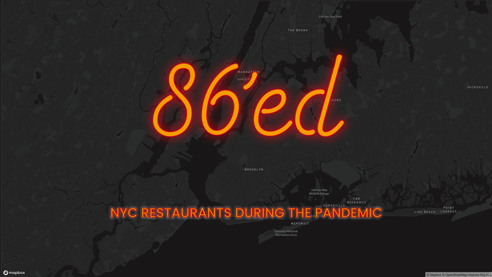

# Title: 86'ed: New York City's Restaurants during the Pandemic

## Abstract

Since March 2020, when the COVID-19 lockdown began, the restaurant industry, employing hundreds of thousands, attracting millions of visitors who spend around $46 billion annually, suffered a dual burden of having lost the customer flow on which it depended on for survival at the same time, it's labour was termed as “essential”. Most of the labour which the industry relies upon is largely undocumented and therefore, unprotected. This labour is also predominantly made up of minority populations with relative lower average wages compared to the rest of the city. The food service industry has been disproportionately hurt during the pandemic. There is a need to understand and document the impact on the hospitality industry because they simultaneously reflect and transform their own streets and neighbourhoods, and in doing so transform the city as a whole. In the following sections, public data on restaurants, labour, federal support, and data collected and ‘scrapped’ from the news sites will be used to chart out and map the significance of the industry to New York City, the damage done by the pandemic, and finally, the attempted recovery efforts.

## Preview

## Storyboard

**[Link to exploratory ideas](https://github.com/shmanzar/thesis/tree/master/storyboard/thesis-storyboard.pdf)**

**[Link to initial storyboard](https://xd.adobe.com/view/96ca491b-d5d1-4d14-9655-59261a81503a-c399/)**

MSDV Thesis 2021 | Parsons School of Design
