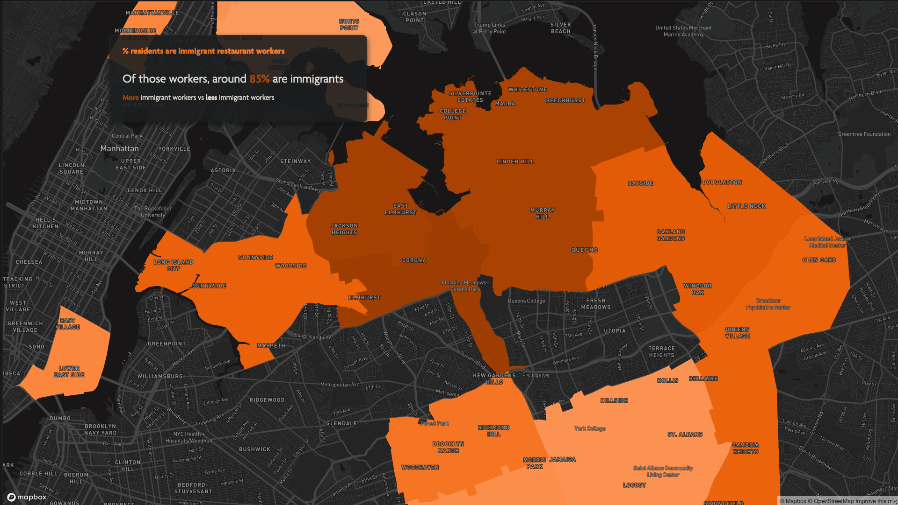

# 86'ed

## New York City's Restaurants during the Pandemic

## Abstract

Since March 2020, when the COVID-19 lockdown began, the restaurant industry, employing hundreds of thousands, attracting millions of visitors who spend around $46 billion annually, suffered a dual burden of having lost the customer flow on which it depended on for survival at the same time, it's labour was termed as “essential”. Most of the labour which the industry relies upon is largely undocumented and therefore, unprotected. This labour is also predominantly made up of minority populations with relative lower average wages compared to the rest of the city. The food service industry has been disproportionately hurt during the pandemic. There is a need to understand and document the impact on the hospitality industry because they simultaneously reflect and transform their own streets and neighbourhoods, and in doing so transform the city as a whole. In the following sections, public data on restaurants, labour, federal support, and data collected and ‘scrapped’ from the news sites will be used to chart out and map the significance of the industry to New York City, the damage done by the pandemic, and finally, the attempted recovery efforts.

## Demo

## Keynote presentation

## Author

Shaheryar Manzar

## Acknowledgements

I would like to thank _Daniel Sauter_ for his unparalleled and invaluable guidance, inspiration, support and advice throughout my time at the school.

I also owe an immense debt of gratitude to _Aaron Hill_ for his patient teaching and unwavering support which laid the foundation for practically all of the technical skills I needed to execute this, and all future, projects. _Richard The_ started me off with my journey into the world of data & design and always pushed me to do better than what I thought I was previously capable of.

I would like to thank _Shannon Mattern_ for helping me unlearn and then relearn what a map is, can be, and should be. _Eric Brelsford_, then patiently and graciously taught me to implement these newly-learned ideas of spatiality into code.

_Sohee Cho_, TA extraordinaire, was a constant source of inspiration, guidance and a trouble-shooter of last resort - I cannot thank her enough.

I would also like to thank _Mio Akasako_ (Class of 2020) in particular, and all of the _alumni_ of the Data Visualization program, in general for their timely, valuable and always generous feedback.

I would like to thank _Chef Sardar Shahnawaz Khan_, _Sardar Shahwali Khan_, _Nargis Boota_ and the entire _Āmú_ staff for teaching me everything I know about restaurants and cooking.

Finally, I owe all my success to my partner, _Sara Obaid_, _my parents_, and the _2021 Class of Data Visualization_ for encouraging, supporting and challenging me to do my best work.

Any and all errors or oversights are mine alone. Any analysis found substantively lacking is due to my own limited knowledge and understanding of the subject matter.

## License

MIT License

## Storyboard

**[Link to exploratory ideas](https://github.com/shmanzar/thesis/tree/master/storyboard/thesis-storyboard.pdf)**

**[Link to initial storyboard](https://xd.adobe.com/view/96ca491b-d5d1-4d14-9655-59261a81503a-c399/)**

MSDV Thesis 2021 | Parsons School of Design
